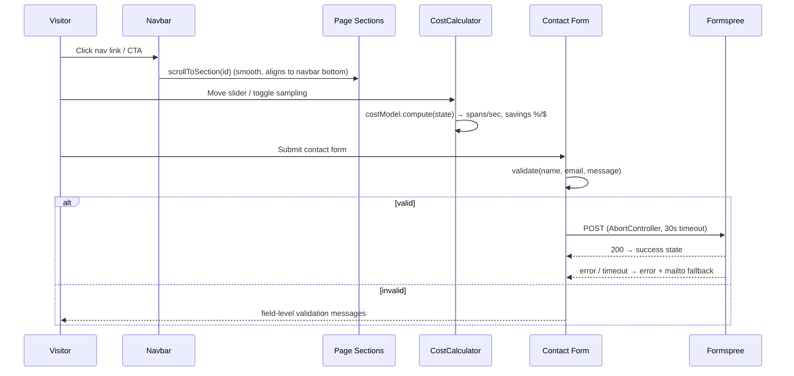

> ## Current State (Change Log) — supersedes the original spec below
>
> The original specification (kept below as historical record) described the
> first release. The shipped site has since evolved based on iterative product
> direction. Where this addendum conflicts with the original text, THIS SECTION
> is authoritative.
>
> **Theme & visual design**
> - Single DARK theme only. The earlier light-default + light/dark toggle was
>   removed (unreadable light mode); `ThemeToggle` deleted, no-flash script
>   removed. Depth comes from borders + surface steps — drop shadows / neon
>   "glow" are disabled site-wide (clean, non-shadowy look).
> - Semantic CSS-variable tokens (`background/surface/surface2/border/fg/muted/
>   accent/accent2`) in `app/globals.css`; consumed via Tailwind aliases.
> - Hero is an image-free animated cover: `.hero-aurora` mesh-gradient backdrop
>   + `.text-gradient` shimmer headline + circular headshot + metric strip.
>
> **Positioning & content (resume is the source of truth)**
> - Voice reframed from "resume / job application" to warm PERSONAL BRAND /
>   PROFILE. Removed "Available for … roles" language.
> - Content aligned to the real resume and reframed toward PROGRAM / PRODUCT
>   leadership (not hands-on IC engineering).
> - Added an **Experience** timeline (SonyLIV AVP + Lead PM, Walmart, Conduent,
>   Intel, early career) and an **Education & Credentials** section (MBA, PG Big
>   Data, B.E.; 7 certifications with credential IDs).
> - Testimonials relabeled as anonymized, role-only recollections (no
>   fabricated named people).
>
> **Download**
> - The "Download Resume (PDF)" action is now **"Download Profile"**
>   (`components/ui/ResumeButton.tsx`). The PDF at
>   `public/Vasista_Sandeep_Resume.pdf` is generated from
>   `scripts/resume.data.mjs` via `npm run generate:profile` and reflects the
>   full real resume.
>
> **Arcade (new engagement feature)**
> - A new `#arcade` section with FIVE domain mini-games: Trivia Blitz, Incident
>   Commander, Prioritization Poker, Error Budget Balancer, Sprint Capacity
>   Planner. Pure game logic in `lib/games.ts` (property + example tested);
>   content in `data/games.ts`; components in `components/games/`.
>
> **SEO**
> - Hardened metadata (keywords, authors/creator/publisher, canonical, robots)
>   and enriched JSON-LD Person node (worksFor, address, alumniOf, knowsAbout).
>
> **Navigation**
> - Nav trimmed/updated: Overview, Experience, Scale, Architecture, Case
>   Studies, Education, Arcade, Contact. (Governance & Endorsements sections
>   remain on the page but are not top-nav links.) The "Scale & Tournaments"
>   label is shortened to "Scale".
>
> **Deployment**
> - Zero-config Vercel deploy. `vercel.json` pins the Next.js framework;
>   `.npmrc` skips Puppeteer's Chromium download in CI (PDF is pre-generated and
>   committed). See `DEPLOY.md` for steps + the go-live checklist.
> - Contact form posts to the live Formspree endpoint (form id `mrpgyepg`).
>
> **Outstanding (needs the site owner)**
> - Replace placeholder `public/vasista-headshot.jpg` (real square photo) and
>   `public/og-image.png` (1200x630 social image).
>

# Design Document

## Overview

This document describes the technical design for the executive portfolio and technical leadership website for Vasista Sandeep, hosted at `vasistasandeep.in`. The site is a single-page, section-based Next.js (App Router) application rendered as a cohesive, dark-mode-first "Tier-1 Silicon Valley platform" experience.

The design satisfies all 22 requirements: a sticky glassmorphism navbar, an animated-metric hero, a high-concurrency events grid, an interactive platform-evolution section, an architectural playbook with tabs, an interactive telemetry/sampling cost calculator, a leadership manifesto, expanded case-study drawers, a credentials bar, testimonials, an executive contact form (Formspree + mailto fallback), an interactive 4-layer architecture flow diagram, and a labs/builder-mindset showcase — all responsive, accessible (WCAG AA), SEO-optimized, and deploy-ready to Vercel with no server secrets.

### Design Goals

- **Zero-config deploy to Vercel** — no backend, no server secrets. The only external call is a client-side POST to a Formspree endpoint. (Req 20)
- **Content-as-data** — all copy and technical data live in centralized, typed content modules so components stay presentational and content is trivially editable. (Req 20.1)
- **Modular components** — one component per section, matching the required filenames, with all interactivity driven by React state. (Req 14)
- **Accessibility and reduced-motion first** — every interactive control is keyboard-operable with proper ARIA, and every animation respects `prefers-reduced-motion`. (Req 17)
- **Performance** — entry animations run once via `viewport={{ once: true }}`, fonts/images are optimized through Next.js primitives, and interactive widgets are code-split as client components. (Req 16)

### Key Technical Decisions

| Decision | Choice | Rationale |
|---|---|---|
| Framework | Next.js 14+ (App Router) | Metadata API for SEO/OpenGraph, RSC + selective client components, first-class Vercel deploy. (Req 15, 20) |
| Language | TypeScript | Type-safe content model and component contracts. |
| Styling | Tailwind CSS + Radix / Shadcn UI primitives | Utility-first theming plus accessible headless primitives (Tabs, Dialog). (Req 5, 8, 17, 19) |
| Animation | Framer Motion | `whileInView` with `once`, `useInView`, `useReducedMotion` for consistent motion + reduced-motion handling. (Req 16, 17) |
| Icons | Lucide React | Consistent, tree-shakeable icon set. |
| Font | Geist Sans (fallback Inter) via `next/font` | Optimized, self-hosted; `tabular-nums` for metric alignment. (Req 16.3) |
| Forms | Formspree (client-side `fetch`) + mailto fallback | No backend/secrets; graceful degradation. (Req 11, 20.2) |
| Hosting | Vercel targeting `vasistasandeep.in` | Zero-config. (Req 20.3) |

## Architecture

### Rendering Model

The root layout is a Server Component that owns global metadata/OpenGraph, fonts, and the global background treatment. `app/page.tsx` is a Server Component that composes the section components in order. Sections that need interactivity (`Navbar`, `Hero` counters, `PlatformEvolution`, `ArchitectureTabs`, `CostCalculator`, `CaseStudyDrawer`, `Contact`, `ArchitectureFlowDiagram`, `Labs`) are Client Components (`"use client"`). Purely presentational sections (`EventsGrid` cards, `Manifesto`, `Credentials`, `Testimonials`, `Footer`) are client only where they need `whileInView` reveal animations, otherwise server-rendered.

Content is imported from typed modules under `data/` (or `lib/content.ts`) at build time, so the entire site is statically generated with no runtime data fetching.

### Navigation Anchor Hierarchy

The navbar links map to section anchors as follows. The `id` on each `SectionWrapper` (rendered as `<section id>`) MUST match the corresponding Target ID so smooth-scroll navigation resolves (Req 1.6).

| Nav Label | Target ID | Component Target | Included Features |
|---|---|---|---|
| Overview | `#overview` | `Hero.tsx` | Metric Strip, Value Proposition |
| Scale & Tournaments | `#tournaments` | `EventsGrid.tsx` | 5 Years of SonyLIV Live Events |
| Architecture | `#architecture` | `ArchitectureFlowDiagram.tsx` & `ArchitectureTabs.tsx` | 4-Layer System Flow, MELT, QoE |
| Case Studies | `#case-studies` | `PlatformEvolution.tsx` & `CaseStudyDrawer.tsx` | Before/After Toggles, In-Depth Drawers |
| Governance | `#governance` | `Manifesto.tsx` & `Credentials.tsx` | Leadership Principles, 9 Certifications |
| Endorsements | `#endorsements` | `Testimonials.tsx` | Executive Peer Recommendations |
| Contact | `#contact` | `Contact.tsx` | Direct Channels, Formspree Form |

Three nav targets group two components under a single section id: **Architecture** (`#architecture` wraps `ArchitectureFlowDiagram.tsx` and `ArchitectureTabs.tsx`), **Case Studies** (`#case-studies` wraps `PlatformEvolution.tsx` and `CaseStudyDrawer.tsx`), and **Governance** (`#governance` wraps `Manifesto.tsx` and `Credentials.tsx`). For each grouped target, the two components render inside a single parent `<section id>` so the anchor resolves to the group as a whole rather than to an individual component. The remaining targets (Overview, Scale & Tournaments, Endorsements, Contact) map one-to-one to a single component's section.

### Directory Structure

```
app/
  layout.tsx            # Root layout: metadata, OpenGraph, JSON-LD (Person + ProfilePage), fonts, global background
  page.tsx              # Composes all sections inside a single <main>
  globals.css           # Tailwind layers + base tokens + grid texture utility + scrollbar-gutter: stable
components/
  Navbar.tsx            # Req 1, 9 nav, mobile menu, resume + LinkedIn actions
  Hero.tsx              # Req 2 headline, metric strip (AnimatedCounter), CTAs
  EventsGrid.tsx        # Req 3 High-Concurrency Arena
  PlatformEvolution.tsx # Req 4 before/after toggles
  ArchitectureTabs.tsx  # Req 5 Radix Tabs playbook
  CostCalculator.tsx    # Req 6 slider + toggle + computed outputs
  Manifesto.tsx         # Req 7 four-card grid
  CaseStudyDrawer.tsx   # Req 8 cards + Radix Dialog drawer
  Credentials.tsx       # Req 9 badge grid/marquee
  Testimonials.tsx      # Req 10 endorsement cards
  Contact.tsx           # Req 11 direct channels + form
  ArchitectureFlowDiagram.tsx # Req 21 interactive 4-layer flow
  Labs.tsx              # Req 22 labs micro-grid
  Footer.tsx            # Req 12
  ui/
    GlassCard.tsx       # Shared glassmorphism card primitive (Req 19)
    SectionWrapper.tsx  # <section> + heading + reveal animation wrapper
    AnimatedCounter.tsx # Count-up counter with once + reduced-motion (Req 2)
    StatusPill.tsx      # "Available for..." pill (Req 1.3)
    ResumeButton.tsx    # Download + fallback modal (Req 13)
    motion.ts           # Shared Framer Motion variants + helpers
lib/
  costModel.ts          # Pure cost calculator computation (Req 6)
  validation.ts         # Pure email/required-field validation (Req 11)
  scroll.ts             # Smooth-scroll-to-section helper (Req 1.6, 2.9/2.10)
data/
  metrics.ts events.ts evolution.ts architecture.ts manifesto.ts
  caseStudies.ts credentials.ts testimonials.ts labs.ts flow.ts
  navigation.ts site.ts
types/
  content.ts            # All content TypeScript interfaces
public/
  Vasista_Sandeep_Resume.pdf  # Req 13
  og-image.png                # Req 15 OpenGraph preview
```

### Component Tree

```mermaid
graph TD
  Layout["app/layout.tsx (RSC)<br/>metadata • OpenGraph • fonts • bg"] --> Page["app/page.tsx (RSC)<br/>single &lt;main&gt;"]
  Layout --> Navbar["Navbar (client)"]
  Layout --> Footer["Footer"]
  Page --> Hero["Hero (client)"]
  Page --> Events["EventsGrid"]
  Page --> Evo["PlatformEvolution (client)"]
  Page --> Flow["ArchitectureFlowDiagram (client)"]
  Page --> Tabs["ArchitectureTabs (client)"]
  Page --> Calc["CostCalculator (client)"]
  Page --> Manifesto["Manifesto"]
  Page --> Cases["CaseStudyDrawer (client)"]
  Page --> Labs["Labs (client)"]
  Page --> Creds["Credentials"]
  Page --> Testi["Testimonials"]
  Page --> Contact["Contact (client)"]

  Hero --> Counter["AnimatedCounter"]
  Calc --> CostModel["lib/costModel.ts"]
  Contact --> Validation["lib/validation.ts"]
  Contact --> Formspree["Formspree endpoint (external)"]
  Navbar --> Scroll["lib/scroll.ts"]
  Hero --> Scroll

  Events -.uses.-> Glass["ui/GlassCard + SectionWrapper"]
  Evo -.uses.-> Glass
  Tabs -.uses.-> Glass
  Calc -.uses.-> Glass
  Manifesto -.uses.-> Glass
  Cases -.uses.-> Glass
  Creds -.uses.-> Glass
  Testi -.uses.-> Glass
  Labs -.uses.-> Glass
  Flow -.uses.-> Glass

  Hero -.data.-> Data[("data/*.ts + types/content.ts")]
  Events -.data.-> Data
  Evo -.data.-> Data
  Tabs -.data.-> Data
  Manifesto -.data.-> Data
  Cases -.data.-> Data
  Creds -.data.-> Data
  Testi -.data.-> Data
  Labs -.data.-> Data
  Flow -.data.-> Data
```



### Request / Interaction Flow



## Components and Interfaces

### Shared UI Primitives

**`ui/SectionWrapper.tsx`** — Renders a semantic `<section id>` with an optional heading and a Framer Motion `whileInView` reveal (`once: true`). It reads `useReducedMotion()` and, when reduced motion is on, renders content statically (no transform/opacity animation). Used by every section to guarantee consistent scroll anchors (Req 1.6), single-run reveals (Req 16.1), and reduced-motion behavior (Req 17.4). Props: `id`, `title?`, `eyebrow?`, `as?` (`"section" | "article"`), `stagger?`.

**`ui/GlassCard.tsx`** — The glassmorphism card primitive: `bg-white/[0.03]`, `backdrop-blur`, `border border-white/10`, rounded, with an optional emerald/cyan hover glow. Encapsulates Req 19.2 and the hover glow used by Req 3.7. Props: `glow?: "emerald" | "cyan" | "none"`, `interactive?: boolean`.

**`ui/AnimatedCounter.tsx`** — Client component that counts a numeric value from 0 to target over a configurable duration when it first becomes ≥50% visible, using `useInView(ref, { amount: 0.5, once: true })` and a `motion` value / `requestAnimationFrame` tween. When `useReducedMotion()` is true, it renders the final formatted value immediately. Formatting (prefix/suffix, decimals, `tabular-nums`) is driven by the metric definition. Implements Req 2.5–2.7, 16.3.

**`ui/StatusPill.tsx`** — The availability pill (Req 1.3). **`ui/ResumeButton.tsx`** — Resume action with fallback modal (Req 13). **`ui/motion.ts`** — Shared variants (`fadeUp`, `staggerContainer`, `staggerItem`) and a `useMotionSafe()` helper returning either the variant or a static "no-op" variant based on `useReducedMotion()`.

### Navbar (`components/Navbar.tsx`) — Req 1, 9, 13

Sticky (`fixed top-0`), full-width, glassmorphism, `border-white/10`. State:

```ts
const [mobileOpen, setMobileOpen] = useState(false);
const [activeSection, setActiveSection] = useState<string | null>(null); // optional scroll-spy
```

- Left: monogram "Vasista Sandeep" + `StatusPill`.
- Center (>768px): nav links from `data/navigation.ts` in the required order (Overview, Scale & Tournaments, Architecture, Case Studies, Governance, Endorsements, Contact). Clicking calls `scrollToSection(targetId)`; if the target element is absent, the handler no-ops and preserves scroll position (Req 1.7).
- Right: `ResumeButton` and a LinkedIn `<a target="_blank" rel="noopener noreferrer">` — the `rel="noopener noreferrer"` attribute prevents reverse-tabnabbing and leaking the opener reference (Req 1.8).
- Layout stability: the global layout/navbar relies on `scrollbar-gutter: stable` (declared on the root in `globals.css`) so that when a Radix `Dialog` (e.g., the case-study drawer or mobile menu) engages its scroll lock, reserving the scrollbar gutter prevents a horizontal layout shift of the fixed navbar and page content (Req 1.12).
- ≤768px: center links are replaced by a `Mobile_Menu` toggle (`aria-expanded`, `aria-controls`) that shows/hides a panel of links (Req 1.9–1.11). Selecting a link closes the menu and scrolls.
- Scroll-spy (optional, progressive enhancement): an `IntersectionObserver` sets `activeSection` to style the current link; disabled gracefully if unsupported.

### Hero (`components/Hero.tsx`) — Req 2

Renders eyebrow badge, headline, sub-headline, the `Metric_Strip` (five `AnimatedCounter` instances from `data/metrics.ts`), and two CTAs. "Explore Architecture" scrolls to the architecture section; "Schedule Advisory Chat" scrolls to contact (Req 2.9–2.10). All copy sourced from data so exact strings match Req 2.1–2.4.

### EventsGrid (`components/EventsGrid.tsx`) — Req 3

Renders four category `GlassCard`s from `data/events.ts` with staggered entry (Req 3.6) and interactive hover glow (Req 3.7, pointer only via `@media (hover: hover)`).

### PlatformEvolution (`components/PlatformEvolution.tsx`) — Req 4

Six evolution items from `data/evolution.ts`. Each item has a Before/After control. State tracks per-item view:

```ts
const [view, setView] = useState<Record<string, "before" | "after">>({});
```

Toggling flips the item between `before` and `after` content (Req 4.8). Content cross-fades with Framer Motion; when reduced motion is on, content swaps instantly (Req 4.9).

### ArchitectureTabs (`components/ArchitectureTabs.tsx`) — Req 5

Built on Radix `Tabs` (`Tabs.Root`, `Tabs.List`, `Tabs.Trigger`, `Tabs.Content`) which provides roving-tabindex keyboard navigation and `aria-selected` out of the box (Req 5.5–5.7, 17.2). Three tabs and their item lists come from `data/architecture.ts`. Active tab uses a distinct emerald/cyan underline + text state (Req 5.6).

### CostCalculator (`components/CostCalculator.tsx`) — Req 6

The most logic-heavy widget. State:

```ts
const [concurrency, setConcurrency] = useState(30_000_000); // slider
const [sampling, setSampling] = useState<"standard" | "tail">("standard"); // default standard
const result = useMemo(() => computeCost({ concurrency, sampling }), [concurrency, sampling]);
```

- Slider: Radix Slider (or native `<input type="range">`) with `min=5_000_000`, `max=30_000_000`, `step=1_000_000`, `aria-valuetext` describing users (Req 6.1, 17.2).
- Sampling toggle: exactly two options, "Standard 100% Ingestion" (default) and "Tail-Based Intelligent Sampling (100% errors / 1% healthy)" (Req 6.2), implemented as a Radix `ToggleGroup`/radio group.
- All outputs (ingested spans/sec, savings % and $) are derived from `computeCost` (pure function in `lib/costModel.ts`) via `useMemo`, so there are no hardcoded outputs (Req 6.7). Recomputation is synchronous and well under 200ms (Req 6.3–6.4).
- The "99.9% MTTR fidelity preserved" statement is always rendered regardless of inputs (Req 6.6).
- Any incoming value outside `[5M, 30M]` is clamped to the nearest bound before computing (Req 6.8) — the pure model clamps, so the UI cannot display an out-of-range-derived value.

### Manifesto (`components/Manifesto.tsx`) — Req 7

Four cards from `data/manifesto.ts` with staggered reveal (Req 7.6).

### CaseStudyDrawer (`components/CaseStudyDrawer.tsx`) — Req 8

Three trigger cards from `data/caseStudies.ts`. The Walmart case study is summarized as a streaming ML audit pipeline that consumes Kafka event streams to detect financial anomalies in real time, recovering millions in revenue leakage (Req 8.5). The drawer is a Radix `Dialog` styled as a right-side slide-over (Sheet pattern). Radix Dialog provides focus trap (Req 8.6), background inert / pointer-blocking overlay (Req 8.7), Escape-to-close (Req 8.8), and focus return to the trigger on close (Req 8.8–8.9). Open/close animations complete within 300ms (Req 8.2, 8.9). State:

```ts
const [openId, setOpenId] = useState<string | null>(null);
```

### Credentials (`components/Credentials.tsx`) — Req 9

Nine certification badges from `data/credentials.ts` in a badge grid (with optional marquee on wide screens). Entry animation on viewport enter (Req 9.3); static when reduced motion is on (Req 9.4).

### Testimonials (`components/Testimonials.tsx`) — Req 10

Three cards from `data/testimonials.ts`, each with profile badge, endorsement text, title, and a LinkedIn placeholder link opening in a new tab (Req 10.2–10.4). Staggered reveal (Req 10.5).

### Contact (`components/Contact.tsx`) — Req 11

Two columns: direct channels (LinkedIn, mailto `contact@vasistasandeep.in`, location line) and the `Contact_Form`. Form state:

```ts
type Status = "idle" | "validating" | "pending" | "success" | "error";
const [values, setValues] = useState<ContactValues>(initial);
const [errors, setErrors] = useState<Partial<Record<Field, string>>>({});
const [status, setStatus] = useState<Status>("idle");
```

Submit flow:
1. Run `validateContact(values)` (pure, `lib/validation.ts`) → per-field errors for empty required fields (Req 11.7) and invalid email (Req 11.6). If any error, set errors, keep `idle`, do not submit.
2. On valid, set `pending` (Req 11.8) and POST to the Formspree endpoint via `fetch` wrapped in an `AbortController` with a 30s timeout.
3. `200` → `success` (Req 11.4). Non-OK / network error → `error` with mailto fallback to `contact@vasistasandeep.in` (fallback `vasista.sandeep@gmail.com`) (Req 11.5). Abort/timeout → exit pending, `error` + fallback (Req 11.9).

Field limits enforced via `maxLength` and validation: Name/Organization ≤100, Work Email ≤254, Message ≤2000 (Req 11.2).

### ArchitectureFlowDiagram (`components/ArchitectureFlowDiagram.tsx`) — Req 21

Four ordered layers from `data/flow.ts` rendered top-to-bottom, each label carrying an explicit `"Layer N:"` prefix to match Req 21.1 ("Layer 1: Client & Edge" → "Layer 2: API Gateway & SSAI Proxy" → "Layer 3: Decoupled Domain Microservices" → "Layer 4: Persistence & Caching") (Req 21.1–21.6). State tracks the active layer/element:

```ts
const [activeLayer, setActiveLayer] = useState<string | null>(null);
```

Each layer is a focusable, keyboard-operable region (`tabIndex`, `role`, `onFocus`/`onMouseEnter`) that applies an active visual state (Req 21.7). Layers reveal with a staggered entry (Req 21.8), static under reduced motion (Req 21.9).

### Labs (`components/Labs.tsx`) — Req 22

Compact micro-grid from `data/labs.ts`. Data guarantees ≥1 AI-automated-workflow item and ≥1 full-stack React/Node/Redis item (Req 22.2). Each item shows title + short descriptor (Req 22.3). Staggered reveal (Req 22.4), static under reduced motion (Req 22.5).

### Footer (`components/Footer.tsx`) — Req 12

Renders the exact copyright/attribution string from `data/site.ts`.

## Data Models

All content is centralized in `types/content.ts` (interfaces) and `data/*.ts` (typed data). Components are presentational and import data; this satisfies pre-population (Req 20.1) and keeps exact required strings in one place.

```ts
// types/content.ts

export interface NavLink { label: string; targetId: string; }

export interface Metric {
  id: string;
  label: string;      // e.g. "Peak Concurrent Viewers"
  target: number;     // e.g. 30
  prefix?: string;    // e.g. "$"
  suffix?: string;    // e.g. "M+", "%", "+", "K"
  decimals?: number;  // e.g. 2 for 99.99
  durationMs?: number; // 1000..2500 (Req 2.5)
}

export interface EventCategory {
  id: string;
  title: string;              // Cricket | Football | ...
  events: string[];           // event names
  note: string;               // scale note
  glow?: "emerald" | "cyan";
}

export interface EvolutionItem {
  id: string;
  title: string;
  before: string;             // Before-state detail
  after: string;              // After-state detail (contains required tech references)
}

export interface ArchitectureTab {
  id: string;
  label: string;              // System Design Patterns | Observability & Telemetry (MELT) | Video Streaming QoE
  items: string[];
}

export interface ManifestoCard { id: string; title: string; principle: string; }

export interface CaseStudy {
  id: string;
  title: string;
  summary: string;            // shown on the trigger card
  body: string[];             // expanded paragraphs shown in drawer
}

export interface Credential { id: string; name: string; }

export interface Testimonial {
  id: string;
  title: string;              // executive title (attribution)
  quote: string;
  linkedInUrl: string;        // placeholder link
  initials: string;           // profile badge
}

export interface LabItem {
  id: string;
  title: string;
  descriptor: string;
  kind: "ai-workflow" | "fullstack" | "other"; // ensures Req 22.2 coverage
}

export interface FlowLayer {
  id: string;
  order: number;              // 1..4 (Req 21.6)
  label: string;              // Client & Edge | API Gateway & SSAI Proxy | ...
  elements: string[];
}

export interface SiteMeta {
  name: string;               // Vasista Sandeep
  monogram: string;
  domain: string;             // vasistasandeep.in
  linkedInUrl: string;
  primaryEmail: string;       // contact@vasistasandeep.in
  fallbackEmail: string;      // vasista.sandeep@gmail.com
  formspreeEndpoint: string;
  resumePath: string;         // /Vasista_Sandeep_Resume.pdf
  footerText: string;
  og: {
    title: string;
    description: string;
    imagePath: string;        // /og-image.png (1200x630)
    siteName: string;         // Vasista Sandeep
    type: string;             // website
  };
  jsonLd: {                   // Person + ProfilePage structured data (Req 15.2)
    personName: string;       // Vasista Sandeep Srinivasa
    url: string;              // https://vasistasandeep.in
    jobTitle: string;         // Platform & Technical Product Leader
    sameAs: string[];         // [linkedInUrl]
    knowsAbout: string[];
  };
}

// Cost calculator model types (lib/costModel.ts)
export type SamplingStrategy = "standard" | "tail";

export interface CostInput { concurrency: number; sampling: SamplingStrategy; }

export interface CostResult {
  concurrency: number;        // clamped concurrency actually used
  spansPerSecond: number;     // ingested spans/sec
  monthlyCostUsd: number;     // estimated APM cost for current strategy
  baselineCostUsd: number;    // standard-ingestion cost at same concurrency
  savingsUsd: number;         // baseline - current (0 for standard)
  savingsPercent: number;     // 0 for standard; 78..82 for tail
  mttrFidelityPercent: 99.9;  // constant (Req 6.6)
}

// Contact form (lib/validation.ts)
export type ContactField = "name" | "email" | "organization" | "message";
export interface ContactValues { name: string; email: string; organization: string; message: string; }
export type ContactErrors = Partial<Record<ContactField, string>>;
```

### Cost Calculator Computation Model (Req 6)

The calculator maps peak concurrency to an ingested-spans-per-second estimate, then to an estimated monthly APM cost, and finally to savings under tail-based sampling. All logic lives in the pure function `computeCost(input: CostInput): CostResult`.

This model is **peak-event-normalized**: rather than assuming the platform sustains its live-match peak concurrency 24×7 (which would inflate the figures unrealistically), it normalizes concurrency across roughly 40 peak live-event hours per month. This keeps the illustrative APM cost grounded in realistic tournament-driven usage.

**Constants**

- `SPANS_PER_USER_PER_SECOND = 5` — average spans emitted per concurrent user per second (each active session traverses ~5 instrumented hops: edge → gateway → playback → persistence → telemetry).
- `COST_PER_MILLION_SPANS_USD = 0.65` — blended APM ingest price per 1M spans (illustrative constant).
- `PEAK_EVENT_HOURS_PER_MONTH = 40` — peak live-event hours normalized per month.
- `SECONDS_PER_PEAK_MONTH = PEAK_EVENT_HOURS_PER_MONTH * 3600 = 144_000` — peak seconds billed per month.
- `ERROR_TRACE_RATIO = 0.01` — 1% of traces are errors, retained at 100%.
- `TAIL_HEALTHY_SAMPLE_RATE = 0.01` — 1% of healthy traces retained under tail-based sampling.
- `MTTR_FIDELITY = 99.9` (Req 6.6).

**Formulas**

1. Clamp concurrency: `c = clamp(concurrency, 5_000_000, 30_000_000)` (Req 6.8).
2. Baseline spans/sec (100% ingestion): `baselineSpansPerSec = c * SPANS_PER_USER_PER_SECOND`.
3. Baseline monthly spans and cost:
   - `baselineMonthlySpans = baselineSpansPerSec * SECONDS_PER_PEAK_MONTH`
   - `baselineCostUsd = round((baselineMonthlySpans / 1_000_000) * COST_PER_MILLION_SPANS_USD)`
4. `standard` strategy: `spansPerSecond = baselineSpansPerSec`, `monthlyCostUsd = baselineCostUsd`, `savingsPercent = 0`, `savingsUsd = 0`.
5. `tail` strategy:
   - Retained fraction: `retainedFraction = ERROR_TRACE_RATIO * 1.0 + (1 - ERROR_TRACE_RATIO) * TAIL_HEALTHY_SAMPLE_RATE` = `0.01 + 0.99 * 0.01` = `0.0199`.
   - `spansPerSecond = round(baselineSpansPerSec * retainedFraction)`.
   - `savingsPercent = round(78 + normalized * 4)` where `normalized = (c - 5_000_000) / (30_000_000 - 5_000_000)` ∈ [0, 1], giving a deterministic value in `[78, 82]` that varies monotonically with the slider.
   - `monthlyCostUsd = round(baselineCostUsd * (1 - savingsPercent / 100))`.
   - `savingsUsd = baselineCostUsd - monthlyCostUsd`.
6. `mttrFidelityPercent = 99.9` always (Req 6.6).

By billing only the ~40 peak live-event hours per month (`SECONDS_PER_PEAK_MONTH`), the model normalizes live-match concurrency to avoid unrealistically inflated 24×7 figures. Savings remains a monotonic non-decreasing function of concurrency within the guaranteed 78–82% band, is exactly `0` for standard, and every output is derived from state (Req 6.5, 6.7). The property guarantees are preserved: concurrency clamping, monotonicity, the `[78, 82]` savings band, deterministic computation, and the constant 99.9% MTTR fidelity all continue to hold under this model.

### Email Validation Model (Req 11.6)

`isValidEmail(email)` trims, rejects empty, enforces length ≤254, and applies a pragmatic single-`@` pattern with a non-empty local part, a domain containing a dot, and no whitespace. `validateContact(values)` returns errors for each empty required field (name, email, message) and an email error for a present-but-invalid email; organization is optional but length-checked ≤100.

## Correctness Properties

*A property is a characteristic or behavior that should hold true across all valid executions of a system — essentially, a formal statement about what the system should do. Properties serve as the bridge between human-readable specifications and machine-verifiable correctness guarantees.*

These properties apply primarily to the pure logic in this feature: the cost calculator (`lib/costModel.ts`), the form validation (`lib/validation.ts`), and the state-toggle/animation invariants of the interactive components. Fixed-content rendering, external I/O (Formspree), and layout/timing behaviors are covered by example, integration, and accessibility tests in the Testing Strategy.

### Property 1: Peak concurrency clamping is bounded and idempotent

*For any* real number `x` supplied as peak concurrency, `computeCost({ concurrency: x, ... }).concurrency` is always within `[5_000_000, 30_000_000]`; equals `5_000_000` when `x < 5_000_000`, equals `30_000_000` when `x > 30_000_000`, equals `x` when already in range; and clamping the clamped value yields the same value (idempotence).

**Validates: Requirements 6.8**

### Property 2: Ingested spans per second is state derived and monotonic

*For any* concurrency value, the standard-strategy `spansPerSecond` equals `clamp(concurrency) * SPANS_PER_USER_PER_SECOND`, and `spansPerSecond` is a monotonic non-decreasing function of concurrency for a fixed strategy.

**Validates: Requirements 6.3, 6.7**

### Property 3: Tail based sampling savings stay within the target band

*For any* concurrency value (including out-of-range values that are clamped), `computeCost({ concurrency, sampling: "tail" }).savingsPercent` is greater than or equal to 78 and less than or equal to 82.

**Validates: Requirements 6.5**

### Property 4: Sampling strategy determines savings semantics and computation is deterministic

*For any* input, `computeCost` is deterministic (equal inputs produce equal outputs), and: when `sampling === "standard"`, `savingsPercent === 0` and `savingsUsd === 0`; when `sampling === "tail"`, `savingsPercent` is in `[78, 82]` and `savingsUsd > 0` whenever `baselineCostUsd > 0`.

**Validates: Requirements 6.7, 6.4**

### Property 5: MTTR fidelity is constant across all inputs

*For any* concurrency value and *for any* sampling strategy, `computeCost(...).mttrFidelityPercent === 99.9`.

**Validates: Requirements 6.6**

### Property 6: Invalid email format is rejected and blocks submission

*For any* string that is not a valid email format, `validateContact` returns an error keyed to the `email` field and the submission guard reports the form as not submittable.

**Validates: Requirements 11.6**

### Property 7: Every empty required field is flagged and blocks submission

*For any* set of contact values in which one or more required fields (`name`, `email`, `message`) is empty or whitespace-only, `validateContact` returns an error for each such empty required field and the submission guard reports the form as not submittable.

**Validates: Requirements 11.7**

### Property 8: Submission is permitted if and only if validation passes

*For any* contact values, the submission guard permits sending to Formspree exactly when `validateContact` returns no errors (all required fields present and a valid email), and blocks it otherwise.

**Validates: Requirements 11.3, 11.6, 11.7**

### Property 9: Mobile menu toggle is an involution

*For any* initial mobile-menu open/closed state and *for any* number `N` of toggle activations, the resulting state equals the initial state when `N` is even and the opposite state when `N` is odd.

**Validates: Requirements 1.10, 1.11**

### Property 10: Platform evolution Before and After toggle is an involution

*For any* evolution item and *for any* number of toggle activations, one activation shows the opposite state and two consecutive activations restore the originally displayed state.

**Validates: Requirements 4.8**

### Property 11: Architecture tabs enforce single-panel mutual exclusion

*For any* tab selected, exactly one content panel is visible — the panel associated with the selected tab — and all other panels are hidden.

**Validates: Requirements 5.5**

### Property 12: Activating a nonexistent nav target preserves scroll position

*For any* navigation label whose target section element does not exist in the document, invoking its activation handler performs no scroll navigation and leaves the scroll position unchanged.

**Validates: Requirements 1.7**

### Property 13: Entry and counter animations trigger at most once

*For any* sequence of viewport enter/exit events on a `SectionWrapper` or `AnimatedCounter`, the reveal/count-up animation is triggered at most one time.

**Validates: Requirements 2.6, 16.1**

### Property 14: Reduced motion disables non-essential motion

*For any* animated component built on the shared motion helper, when `prefers-reduced-motion` is enabled the applied motion variant is the static no-op variant (final state, no transform/opacity transition and no marquee).

**Validates: Requirements 2.7, 4.9, 9.4, 17.4, 21.9, 22.5**

### Property 15: Labs dataset covers required kinds with complete fields

*For any* valid build of the labs dataset, it contains at least one item with `kind === "ai-workflow"` and at least one item with `kind === "fullstack"`, and every item has a non-empty `title` and non-empty `descriptor`.

**Validates: Requirements 22.2, 22.3**

## Error Handling

### Contact form (Req 11)

- **Validation failure** — `validateContact` returns per-field messages; the form stays in `idle`, renders field-level errors (identifying the Work Email field for invalid email, and each empty required field), and does not call Formspree. (Req 11.6, 11.7)
- **Network / non-OK response** — the `fetch` promise rejects or returns a non-2xx status; the form transitions to `error` and renders a mailto fallback to `contact@vasistasandeep.in` with the fallback address `vasista.sandeep@gmail.com`. (Req 11.5)
- **Timeout (30s)** — an `AbortController` with a 30-second `setTimeout` aborts the request; the `AbortError` is caught, the form exits `pending`, transitions to `error`, and renders the same mailto fallback. The timeout is always cleared in a `finally` block to avoid leaks. (Req 11.9)
- **Field overflow** — inputs enforce `maxLength` (Name/Organization 100, Work Email 254, Message 2000); validation defensively rejects over-limit values. (Req 11.2)

### Resume download (Req 13)

`ResumeButton` performs a lightweight availability check before opening: a `fetch(resumePath, { method: "HEAD" })` (or an `onerror` handler on a hidden anchor/iframe). On success it opens/downloads `/Vasista_Sandeep_Resume.pdf`; on 404/failure it opens a graceful modal offering to request the resume by email to `contact@vasistasandeep.in`. The check is resilient to network errors (treated as "unavailable" → fallback modal). (Req 13.1–13.3)

### Navigation (Req 1.7)

`scrollToSection(id)` looks up the target element; if `document.getElementById(id)` is null, it returns without scrolling, preserving the current position. This guards against renamed/missing anchors.

### Rendering / data integrity

Content modules are typed; a build-time type error surfaces if a required field is missing. Optional fields (e.g., `Organization`) are handled explicitly. Components render defensively (e.g., empty arrays produce empty grids rather than throwing).

## Testing Strategy

A dual approach: **property-based tests** for pure logic and universal invariants, and **example / interaction / integration / accessibility tests** for fixed content, I/O, timing, and a11y behaviors.

### Tooling

- **Test runner:** Vitest (fast, TS-native, jsdom environment). Run once with `vitest --run` (no watch mode).
- **Component/interaction:** React Testing Library + `@testing-library/user-event`.
- **Property-based testing:** `fast-check` (the standard PBT library for TypeScript). We do **not** implement PBT from scratch.
- **Accessibility:** `jest-axe` / `axe-core` for automated checks; manual assistive-technology review noted as required for full WCAG conformance.

### Property-Based Tests

Each correctness property maps to a **single** `fast-check` property test configured for **at least 100 iterations** (`{ numRuns: 100 }`). Each test is tagged with a comment referencing its design property using the format:

`// Feature: executive-portfolio-site, Property {number}: {property_text}`

| Property | Target under test | Generators |
|---|---|---|
| 1 Clamp bounds + idempotence | `computeCost` / `clamp` | `fc.integer`/`fc.double` including out-of-range |
| 2 Spans/sec derivation + monotonicity | `computeCost` | pairs of concurrency values, in-range integers |
| 3 Tail savings in [78,82] | `computeCost` (tail) | full range incl. out-of-range |
| 4 Strategy semantics + determinism | `computeCost` | concurrency × {standard,tail} |
| 5 MTTR constant | `computeCost` | concurrency × strategy |
| 6 Invalid email rejected | `validateContact` / `isValidEmail` | malformed email strings (no `@`, whitespace, empty, oversized) |
| 7 Empty required fields flagged | `validateContact` | records with random empty/whitespace subsets |
| 8 Submission guard iff valid | `canSubmit`/`validateContact` | arbitrary contact values |
| 9 Mobile menu involution | menu reducer/toggle | random toggle-count sequences |
| 10 Evolution toggle involution | evolution toggle logic | random items × toggle sequences |
| 11 Tabs mutual exclusion | tab selection logic | random selected tab index |
| 12 Nonexistent target no-op | `scrollToSection` | random labels with absent targets |
| 13 Animate-once | reveal/counter run-once logic | random enter/exit sequences |
| 14 Reduced-motion no-op | `useMotionSafe` variant selection | random variants with reduced-motion flag |
| 15 Labs dataset coverage | `data/labs.ts` | dataset invariant assertion |

Where component state is involved (Properties 9–13), the toggle/selection/run-once logic is extracted into pure reducers/helpers so it can be property-tested without a DOM, and thin component tests confirm the wiring.

### Example / Unit Tests

- **Fixed content:** EventsGrid categories/events/notes (Req 3), Evolution details (Req 4.2–4.7), Tab items (Req 5.2–5.4), Manifesto (Req 7), Credentials list (Req 9.1), Testimonials (Req 10.1–10.2), Flow layers/elements (Req 21.1–21.5), Footer string (Req 12), Hero copy (Req 2.1–2.4).
- **Cost calculator representative cases:** min (5M) and max (30M) concurrency under both strategies; assert spans/sec, cost, savings, and the always-present 99.9% MTTR statement (Req 6.1–6.7).
- **Counter:** simulate ≥50% intersection → final value shown (Req 2.5).
- **Resume:** available → opens path; HEAD 404 / onerror → fallback modal (Req 13).

### Interaction / Component Tests

- Navbar: link click scrolls to existing section; missing target no-op; LinkedIn opens new tab; mobile menu toggle show/hide at ≤768px (Req 1).
- Architecture tabs: pointer + keyboard (arrow keys move focus, Enter/Space selects) (Req 5.5–5.7).
- Case study drawer: open on card activation, focus trap, Escape closes and returns focus to trigger, background non-interactive (Req 8.2, 8.6–8.9).
- Cost calculator: slider + toggle drive recomputation (Req 6.3–6.4).
- Architecture flow diagram: pointer/keyboard activates a layer's active state (Req 21.7).

### Integration Tests (mocked I/O)

- Contact form → Formspree: mock `fetch` to resolve `200` (success state, Req 11.4), reject/non-OK (error + mailto fallback, Req 11.5), and abort after 30s (timeout → error + fallback, Req 11.9); assert `pending` shown during the in-flight request (Req 11.8). 1–3 representative cases each — not property tests, since behavior does not vary meaningfully with input and the call is external.

### Accessibility Tests

- `jest-axe` on the rendered page and key interactive components (no violations).
- Keyboard-only traversal of nav, tabs, slider, drawer, and form (Req 17.1).
- ARIA presence on Mobile_Menu, Tabs, Dialog, and slider (Req 17.2).
- Visible focus indicator assertions (Req 17.5).
- Automated contrast checks on token pairs (Req 17.3) with a note that full WCAG AA conformance requires manual assistive-technology review.

### Smoke / Static Checks

- Exported `metadata` includes title, description, and `openGraph` fields (Req 15.1).
- Page renders exactly one `<main>` and a `<section>` per content area (Req 15.2).
- No server API routes with secrets; the only external call is the client-side Formspree fetch (Req 20.2).

## Design System

### Theme Tokens (Tailwind)

Dark-mode-first. Tokens extend `tailwind.config.ts` and are surfaced as CSS variables in `globals.css`.

| Token | Value | Usage | Requirement |
|---|---|---|---|
| `--bg` | `slate-950` / obsidian `#0a0f1a` | Page background | 19.1 |
| Card surface | `bg-white/[0.03]` + `backdrop-blur-md` | Glass cards | 19.2 |
| Card border | `border-white/10` | Cards + navbar | 1.12, 19.2 |
| Heading text | `text-white` | Headings | 19.3 |
| Body text | `text-slate-400` | Body copy | 19.3 |
| Accent emerald | `emerald-400/500` | Glows, active states | 19.3 |
| Accent cyan | `cyan-400/500` | Glows, active states | 19.3 |
| Glow shadow | `shadow-[0_0_40px_-10px_rgba(16,185,129,0.35)]` (emerald) / cyan variant | Hover/active glow | 3.7, 19.3 |
| Grid texture | radial/linear grid via `background-image` utility `.bg-grid` | Background surfaces | 19.4 |
| Font | Geist Sans (fallback Inter) via `next/font` | Global | 16.3 |
| Numeric | `tabular-nums` utility | Metrics / calculator | 16.3 |

`.bg-grid` is a reusable utility applying a faint white grid (`linear-gradient` lines at low opacity) with a mask fade, layered behind content for the subtle grid texture (Req 19.4).

### Reusable Primitives

- **`GlassCard`** — glassmorphism surface + optional accent glow; `interactive` enables hover glow gated behind `@media (hover: hover)` so touch devices don't trigger it (Req 3.7, 19.2).
- **`SectionWrapper`** — semantic section/article, heading, and once-only reveal with reduced-motion awareness (Req 15.2, 16.1, 17.4).
- **`AnimatedCounter`** — count-up with `tabular-nums`, run-once, reduced-motion final-value fallback (Req 2.5–2.7, 16.3).
- **`ui/motion.ts`** — variants `fadeUp`, `staggerContainer`, `staggerItem`, and `useMotionSafe(variant)` returning a static no-op variant when `useReducedMotion()` is true. This single helper centralizes the reduced-motion strategy for Property 14 (Req 17.4).

### Reduced-Motion Strategy

Two complementary layers:
1. **Framer Motion `useReducedMotion()`** — `useMotionSafe` swaps animated variants for static ones; `AnimatedCounter` renders final values; Before/After and tab transitions swap instantly.
2. **CSS `@media (prefers-reduced-motion: reduce)`** — a global rule in `globals.css` neutralizes transitions/animations (including the Credentials marquee) as a defense-in-depth backstop.

## Accessibility

- **Keyboard operability (Req 17.1):** all controls reachable and operable via keyboard. Radix Tabs (roving tabindex), Radix Dialog (focus trap + Escape), Radix Slider/ToggleGroup provide correct keyboard semantics; nav links and buttons are native focusable elements; the flow diagram layers are focusable with `tabIndex`.
- **ARIA (Req 17.2):** Mobile_Menu toggle uses `aria-expanded`/`aria-controls`; Tabs expose `role="tab"/"tabpanel"` + `aria-selected`; Dialog exposes `role="dialog"` + `aria-modal` + labelled title; slider exposes `aria-valuemin/max/now/text`.
- **Contrast (Req 17.3):** white headings and slate-400 body on slate-950 target WCAG AA; accent-on-dark pairs validated; automated checks plus manual review.
- **Reduced motion (Req 17.4):** see Reduced-Motion Strategy.
- **Visible focus (Req 17.5):** global `:focus-visible` ring (emerald/cyan) on all interactive elements; never removed without replacement.

## Responsive Layout

- **Breakpoints:** Tailwind defaults; the mobile breakpoint boundary is `768px` per Req 1.9/18.2. `sm/md/lg/xl` used for progressive multi-column layouts.
- **Navbar (Req 1.9):** center links at `md+`; `Mobile_Menu` toggle at ≤768px.
- **Stacking (Req 18.2):** grids (events, manifesto, testimonials, labs, calculator two-column, contact two-column) collapse to single column at the mobile breakpoint via responsive grid classes.
- **Fluid type/spacing:** clamp-based heading sizes and responsive padding keep the hero and metric strip legible across desktop/tablet/mobile (Req 18.1).

## Performance

- **Once-only reveals (Req 16.1):** every reveal uses Framer `whileInView` with `viewport={{ once: true }}` (or `useInView(..., { once: true })`), so animations fire a single time.
- **Fonts (Req 16.2–16.3):** Geist/Inter via `next/font` (self-hosted, `display: swap`, subset) — no layout shift, no external font request.
- **Images (Req 16.2):** `next/image` for any raster assets (e.g., OG image, profile badges) with proper sizing/lazy loading.
- **Code-splitting:** heavy interactive client components (CostCalculator, CaseStudyDrawer, ArchitectureFlowDiagram) are isolated as client components; the rest of the page is server-rendered/static, minimizing the client bundle.
- **Static generation:** all content is build-time data, so the page is statically generated for fast TTFB on Vercel.

## SEO and Semantic Markup

- **Metadata (Req 15.1):** `app/layout.tsx` exports the App Router `metadata` object with concrete values sourced from `data/site.ts`:
  - `title`: `"Vasista Sandeep | Platform & Technical Product Leadership"`
  - `description`: `"14+ years architecting distributed platforms, OTT media supply chains, and enterprise transformations across 30M+ peak concurrent users."`
  - `metadataBase`: `https://vasistasandeep.in`
  - `openGraph`: `title`/`description` as above, `siteName: "Vasista Sandeep"`, `url: "https://vasistasandeep.in"`, `images: ["/og-image.png"]` (1200×630), `type: "website"`, plus `twitter` card fields.
- **JSON-LD structured data (Req 15.2):** in addition to the OpenGraph metadata, `app/layout.tsx` embeds JSON-LD structured data of types `Person` and `ProfilePage` via a `<script type="application/ld+json">` tag in the document head. The `Person` node uses `name: "Vasista Sandeep Srinivasa"`, `url: "https://vasistasandeep.in"`, `sameAs: [linkedInUrl]`, `jobTitle: "Platform & Technical Product Leader"`, and `knowsAbout: ["Distributed Systems", "OTT Streaming Architecture", "OpenTelemetry", "Server-Side Ad Insertion (SSAI)", "Graceful Degradation & Fallback Operations (GDFO)", "High-Concurrency Platforms"]`. The `ProfilePage` node references the `Person` as its main entity. Values are sourced from `data/site.ts` (`SiteMeta.jsonLd`).
- **Semantic structure (Req 15.2):** a single `<main>` in `app/page.tsx`; each area rendered as a `<section id>` via `SectionWrapper`; case studies and testimonials use `<article>` where an item is a self-contained unit. Section `id`s match the nav `targetId`s so smooth-scroll anchors resolve (Req 1.6).

## Deployment Readiness

- **Pre-populated content (Req 20.1):** all copy/data in `data/*.ts`; no runtime data entry.
- **No secrets/backend (Req 20.2):** the only network call is the client-side Formspree POST; the Formspree endpoint is a public form URL (not a secret). No API routes, no env-based secrets required to render.
- **Zero-config Vercel (Req 20.3):** standard Next.js App Router project; deploy to Vercel and point the `vasistasandeep.in` domain. Resume served statically from `public/`.

### Deployment Checklist

- Ensure `/public/Vasista_Sandeep_Resume.pdf` is present (resume download, Req 13).
- Ensure `/public/og-image.png` (1200×630) is present (OpenGraph preview, Req 15).
- Configure the Formspree form endpoint in `data/site.ts` (`SiteMeta.formspreeEndpoint`).
- Deploy to Vercel and assign the `vasistasandeep.in` domain with automatic SSL.

## Requirements Traceability

| Req | Design element(s) |
|---|---|
| 1 Navbar | `Navbar.tsx` (sticky, monogram, StatusPill, ordered links, resume + LinkedIn, mobile menu, `border-white/10`); `lib/scroll.ts`; Props P9, P12 |
| 2 Hero | `Hero.tsx`, `AnimatedCounter`, `data/metrics.ts`, `lib/scroll.ts`; P13, P14 |
| 3 Events Grid | `EventsGrid.tsx`, `GlassCard` hover glow, `data/events.ts` |
| 4 Platform Evolution | `PlatformEvolution.tsx`, per-item toggle state, `data/evolution.ts`; P10, P14 |
| 5 Architecture Tabs | `ArchitectureTabs.tsx` (Radix Tabs), `data/architecture.ts`; P11 |
| 6 Cost Calculator | `CostCalculator.tsx`, `lib/costModel.ts` (compute model); P1–P5 |
| 7 Manifesto | `Manifesto.tsx`, `data/manifesto.ts` |
| 8 Case Study Drawer | `CaseStudyDrawer.tsx` (Radix Dialog/Sheet), `data/caseStudies.ts` |
| 9 Credentials | `Credentials.tsx`, `data/credentials.ts`; P14 (marquee) |
| 10 Testimonials | `Testimonials.tsx`, `data/testimonials.ts` |
| 11 Contact | `Contact.tsx`, `lib/validation.ts`, Formspree fetch + AbortController + mailto fallback; P6–P8 |
| 12 Footer | `Footer.tsx`, `data/site.ts` |
| 13 Resume | `ui/ResumeButton.tsx`, `public/Vasista_Sandeep_Resume.pdf`, fallback modal |
| 14 Modularity | `components/*` filenames match; React state for all interactivity |
| 15 SEO/Semantic | `app/layout.tsx` metadata/OpenGraph; `SectionWrapper` semantic structure |
| 16 Performance | `viewport once`, `next/font`, `next/image`, code-splitting; P13 |
| 17 Accessibility | Radix primitives, ARIA, focus-visible, contrast tokens, reduced motion; P14 |
| 18 Responsive | Tailwind breakpoints, 768px mobile boundary, single-column stacking |
| 19 Visual Design | Theme tokens, `GlassCard`, `.bg-grid`, emerald/cyan glows |
| 20 Deployment | `data/*` pre-population, client-only Formspree, zero-config Vercel |
| 21 Architecture Flow | `ArchitectureFlowDiagram.tsx`, `data/flow.ts`, active-layer state; P14 |
| 22 Labs | `Labs.tsx`, `data/labs.ts`; P15, P14 |
